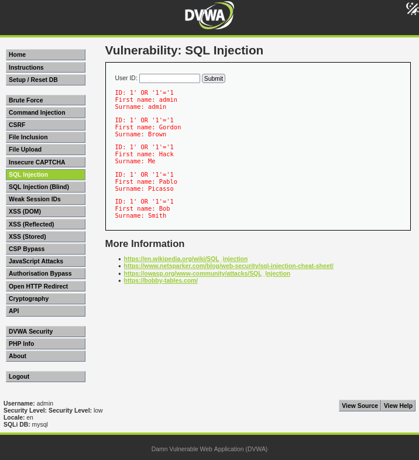
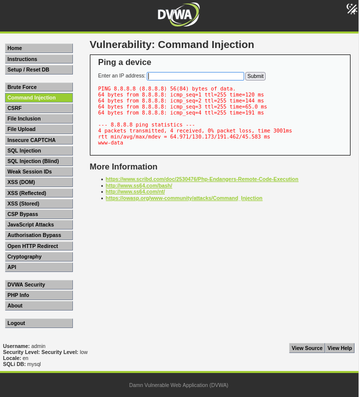
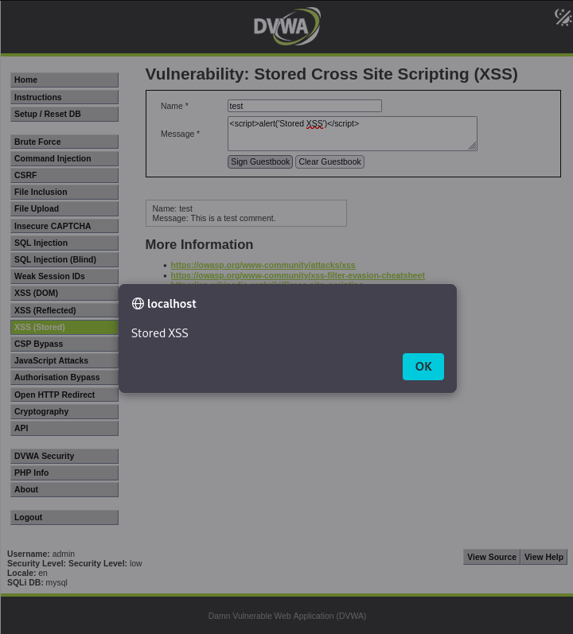
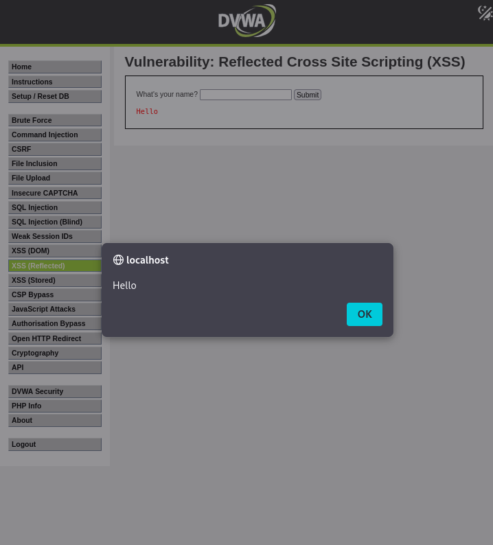
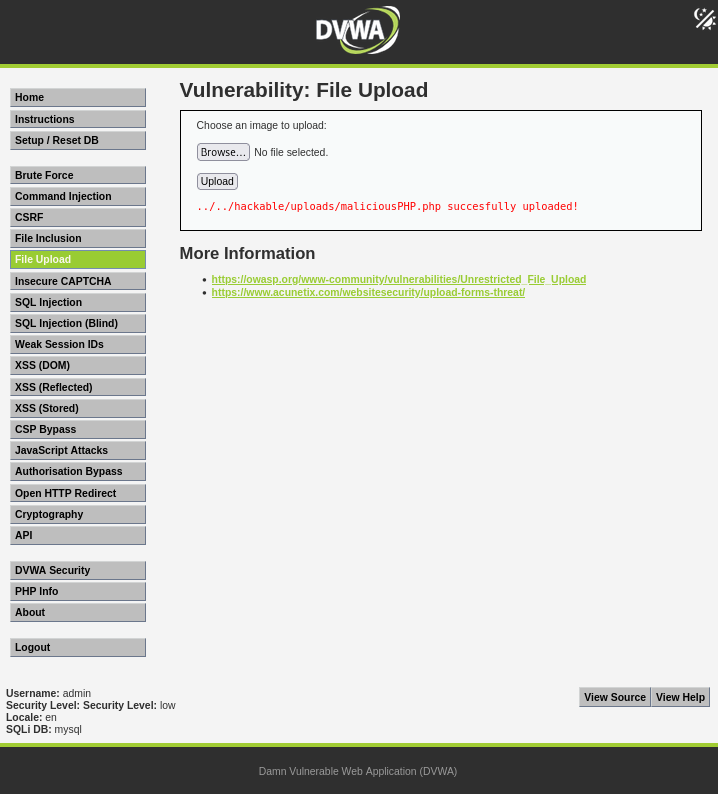
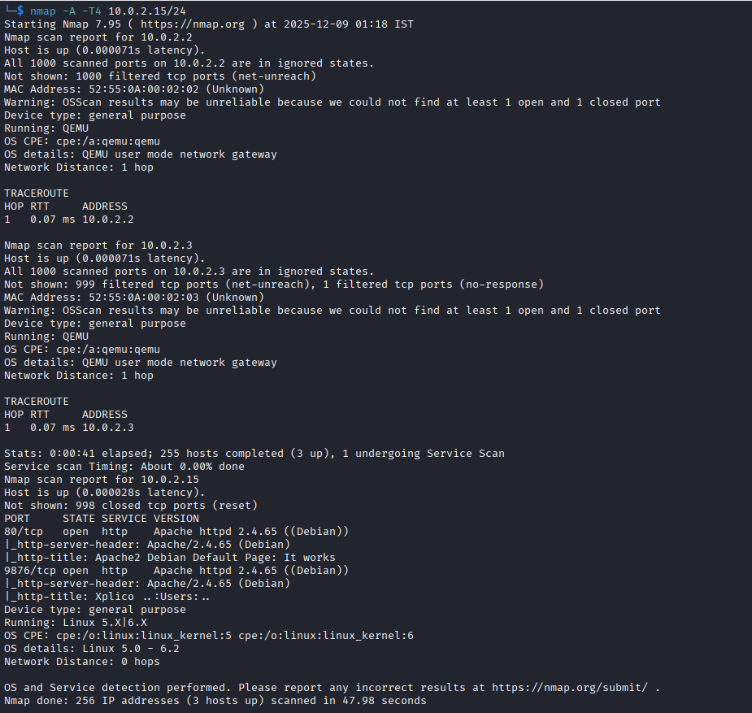
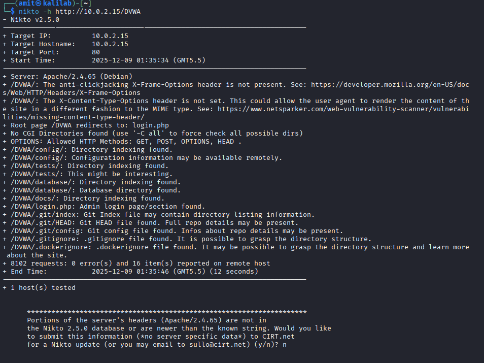
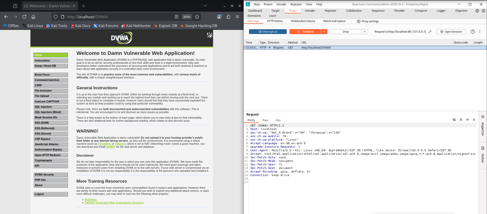

<div align="center">
# **🔒 Vulnerability Assessment & Penetration Testing (VAPT) — DVWA**

> A comprehensive web application penetration testing project demonstrating real-world vulnerability exploitation and security analysis


</div>

---

## 📋 **Project Overview**

This repository documents a full-scale Vulnerability Assessment and Penetration Testing (VAPT) engagement conducted on **Damn Vulnerable Web Application (DVWA)** within a Kali Purple virtual environment. The project follows industry-standard methodologies to identify, exploit, and document critical security vulnerabilities in web applications.

**Objective:** Systematically identify security weaknesses → Exploit vulnerabilities → Document findings → Provide actionable remediation strategies

**Tools & Environment:**
- Kali Purple (Attacker Machine)
- DVWA v1.10 (Target Application)
- Burp Suite Professional (Web Proxy & Scanner)
- Nmap, Nikto, SQLMap (Reconnaissance & Exploitation)

This project serves as a practical demonstration of penetration testing skills and vulnerability research capabilities.

---

## ✨ **Key Features**

- ✅ **SQL Injection** — Boolean-based and UNION-based attacks with full database enumeration
- ✅ **Command Injection** — Remote Code Execution (RCE) achieving system-level access
- ✅ **Stored XSS** — Persistent JavaScript injection with session hijacking potential
- ✅ **Reflected XSS** — Client-side attack vectors with proof-of-concept demonstrations
- ✅ **File Upload Exploit** — Malicious file upload leading to webshell deployment
- ✅ **Network Reconnaissance** — Nmap port scanning and Nikto vulnerability assessment
- ✅ **Traffic Interception** — Burp Suite request manipulation and analysis
- ✅ **Complete Documentation** — Detailed findings with proof-of-concept screenshots

---

## 📁 **Repository Structure**

```
DVWA-VAPT-Assessment/
│
├── report/
│   └── VAPT_Report_DVWA.pdf
│
├── evidence/
│   └── screenshots/
│       ├── SQLi-boolean.png
│       ├── SQLi-union.png
|       ├── SQLi-db.png
│       ├── SQLi-db-user.png
|       ├── SQLi-db-version.png
|       ├── SQLi-hostname.png
│       ├── cmd-whoami.png
│       ├── cmd-ls.png
│       ├── xss-reflected.png
│       ├── xss-stored.png
│       ├── file-upload.png
│       ├── nmap.png
│       ├── nikto.png
|       └── burp-suite.png
│
├── README.md
└── LICENSE
```

---

## 🎯 **Methodology**

This assessment follows the **OWASP Web Security Testing Guide** and standard penetration testing frameworks:

### 1. **Reconnaissance**
Information gathering, technology fingerprinting, and attack surface mapping using passive and active reconnaissance techniques.

### 2. **Scanning & Enumeration**
Automated vulnerability scanning with Nmap and Nikto, followed by manual service enumeration and version detection.

### 3. **Exploitation**
Manual exploitation of identified vulnerabilities including injection attacks, XSS, and insecure file uploads with proof-of-concept development.

### 4. **Post-Exploitation & Evidence Collection**
Documentation of successful exploits with screenshots and impact analysis demonstrating business risk.

### 5. **Reporting & Remediation**
Comprehensive report generation with prioritized findings, remediation guidance, and security recommendations.

---

## 🚨 **Vulnerability Findings Summary**

| Vulnerability | Severity | Description |
|--------------|----------|-------------|
| SQL Injection | **Critical** | Authentication bypass and database extraction via unsanitized user input |
| Command Injection | **Critical** | Operating system command execution through vulnerable input fields |
| Stored XSS | **High** | Persistent JavaScript injection leading to session hijacking |
| Reflected XSS | **High** | Client-side script execution via malicious URL parameters |
| Arbitrary File Upload | **High** | Unrestricted file upload enabling webshell deployment |
| Security Misconfigurations | **Medium** | Default credentials, verbose error messages, missing headers |

---

## 🔍 **Detailed Findings**

### 1. **SQL Injection (Boolean-Based & UNION)**

**Summary:**  
The application fails to sanitize user input in authentication forms and search parameters, allowing attackers to inject malicious SQL queries. Both Boolean-based blind SQLi and UNION-based techniques were successful.

**Payloads Used:**

```sql
1' OR '1'='1
1' UNION SELECT 1,2 -- -
1' UNION SELECT user(),2 -- -
1' UNION SELECT database(),2 -- -
1' UNION SELECT version(),2 -- -
1' UNION SELECT @@hostname,2 -- -
```

**Impact:**  
Complete database compromise including authentication bypass, data exfiltration, and potential for privilege escalation. Attackers can extract usernames, password hashes, and sensitive application data.

**Remediation:**
- Implement parameterized queries (prepared statements)
- Use ORM frameworks with built-in SQL injection protection
- Apply principle of least privilege to database accounts
- Enable Web Application Firewall (WAF) rules

---

### 2. **Command Injection (Remote Code Execution)**

**Summary:**  
User-supplied input is passed directly to system commands without validation, allowing arbitrary OS command execution with web server privileges.

**Payloads Used:**

```sh
8.8.8.8; whoami
127.0.0.1; ls
```

**Impact:**  
Full system compromise, reverse shell access, data theft, lateral movement potential, and complete server takeover. Attackers can read sensitive files, modify configurations, and establish persistent backdoors.

**Remediation:**
- Never pass user input directly to system commands
- Use built-in language functions instead of shell commands
- Implement strict input validation with whitelist approach
- Run web applications with minimal privileges

---

### 3. **Stored Cross-Site Scripting (XSS)**

**Summary:**  
The application stores user input in the database without proper sanitization and renders it without output encoding, creating persistent XSS vulnerabilities.

**Payloads Used:**

```js
<script>alert('Stored XSS')</script>
```

**Impact:**  
Session hijacking, credential theft, malware distribution, phishing attacks, and defacement. Every user viewing the infected page executes malicious JavaScript in their browser context.

**Remediation:**
- Implement context-aware output encoding
- Use Content Security Policy (CSP) headers
- Enable HTTPOnly and Secure flags on cookies
- Sanitize input on both client and server side

---

### 4. **Reflected Cross-Site Scripting (XSS)**

**Summary:**  
User input from URL parameters is reflected in HTML responses without proper encoding, enabling client-side script injection attacks.

**Payloads Used:**

```js
<script>alert('Hello')</script>
```

**Impact:**  
Credential phishing, session token theft, malicious redirects, and social engineering attacks through crafted URLs.

**Remediation:**
- Encode all output data based on context (HTML, JavaScript, URL)
- Validate and sanitize input parameters
- Implement CSP with strict policies
- Use framework-provided templating engines with auto-escaping

---

### 5. **Arbitrary File Upload**

**Summary:**  
The application accepts file uploads without proper validation of file type, content, or extension, allowing upload of executable scripts.

**Payloads Used:**

```php
echo "<?php echo 'H@cked'; ?>" > maliciousPHP.php
```

**Impact:**  
Webshell deployment, remote code execution, complete server compromise, malware hosting, and defacement. Attackers gain persistent access to execute arbitrary commands.

**Remediation:**
- Validate file types using MIME type checking and magic number verification
- Rename uploaded files and remove executable permissions
- Store uploads outside web root directory
- Implement file size limits and antivirus scanning

---

### 6. **Security Misconfigurations**

**Summary:**  
Multiple security misconfigurations including default credentials, directory listing, verbose error messages, and missing security headers.

**Impact:**  
Information disclosure, reduced defense in depth, easier reconnaissance for attackers, and increased attack surface.

**Remediation:**
- Change all default credentials
- Disable directory listing and file browsing
- Implement custom error pages
- Add security headers (X-Frame-Options, X-Content-Type-Options, HSTS)
- Regular security configuration reviews

---

## 🛠️ **Tools Used**

- ✔️ **Kali Purple** — Defensive security-focused Linux distribution
- ✔️ **DVWA** — Damn Vulnerable Web Application (Target)
- ✔️ **Burp Suite** — Web application security testing platform
- ✔️ **Nmap** — Network discovery and port scanning
- ✔️ **Nikto** — Web server vulnerability scanner
- ✔️ **SQLMap** — Automated SQL injection exploitation
- ✔️ **Firefox** — Browser with proxy configuration

<div align="center">


</div>

---

## 📸 **Screenshots (Evidence Preview)**

Below are a few highlights from the exploitation phase:

| SQL Injection | Command Injection | Stored XSS | Reflected XSS |
|--------------|-------------------|------------|---------------|
|  |  |  |  |

| Arbitrary File Upload | Nmap | Nikto |
|-----------------------|------|-------|
|  |  |  |

| Burp Suite |
|------------|
|  |

## ⚙️ **Setup Instructions**

### **Prerequisites**
- VirtualBox or VMware with Kali Purple installed
- DVWA configured on Apache/MariaDB stack

### **Installation Steps**

1. **Start Web Services**

```sh
   sudo systemctl start apache2
   sudo systemctl start mariadb
```

2. **Configure DVWA**
   - Navigate to `http://localhost/dvwa`
   - Complete database setup
   - Login with default credentials (admin/password)

3. **Set Security Level**
   - Go to DVWA Security tab
   - Set security level to **Low** for testing
   - Click Submit

4. **Configure Burp Suite Proxy**
   - Start Burp Suite
   - Configure Firefox proxy: 127.0.0.1:8080
   - Import Burp's CA certificate

5. **Begin Testing**
   - Navigate through DVWA modules
   - Intercept requests with Burp Suite
   - Execute exploits and document findings

---

## 📊 **CVSS Score Reference**

| Vulnerability | CVSS v3.1 Score | Severity |
|--------------|-----------------|----------|
| SQL Injection | **9.8** | Critical |
| Command Injection | **9.8** | Critical |
| Arbitrary File Upload | **8.6** | High |
| Stored XSS | **7.5** | High |
| Reflected XSS | **6.1** | Medium |
| Security Misconfigurations | **5.0** | Medium |

---

## 📄 **Full Report**

The complete penetration testing report with detailed findings, screenshots, and remediation strategies is available here:

➡️ **[VAPT_Report_DVWA.pdf](report/VAPT_Report_DVWA.pdf)**

---

## 👨‍💻 **Author**

**Amit Mondal**  
Cybersecurity Enthusiast | Ethical Hacker | Security Researcher

*"Security is not a product, but a process. This project represents a commitment to continuous learning and ethical hacking practices."*

📧 Contact: [amitmondalxii@gmail.com](mailto:amitmondalxii@gmail.com) |
🔗 LinkedIn: [amit-mondal-xii](https://www.linkedin.com/in/amit-mondal-xii) |
🐙 GitHub: [Detox-coder](https://github.com/Detox-coder)

---

## 📜 **License**

This project is licensed under the MIT License - see the [LICENSE](LICENSE) file for details.

---

## ⚠️ **Legal Disclaimer**

This project is for **educational purposes only**. All testing was performed in a controlled lab environment on intentionally vulnerable applications. Unauthorized access to computer systems is illegal. Always obtain proper authorization before conducting security assessments.

---

## 🙏 **Acknowledgments**

- DVWA Development Team for creating an excellent learning platform
- OWASP for comprehensive security testing guidelines
- Offensive Security for Kali Linux distribution

---

<div align="center">

  ### 🌟 If you found this project helpful, please give it a star! 🌟

  *Built with ❤️ for cybersecurity education and network security awareness*
</div>
